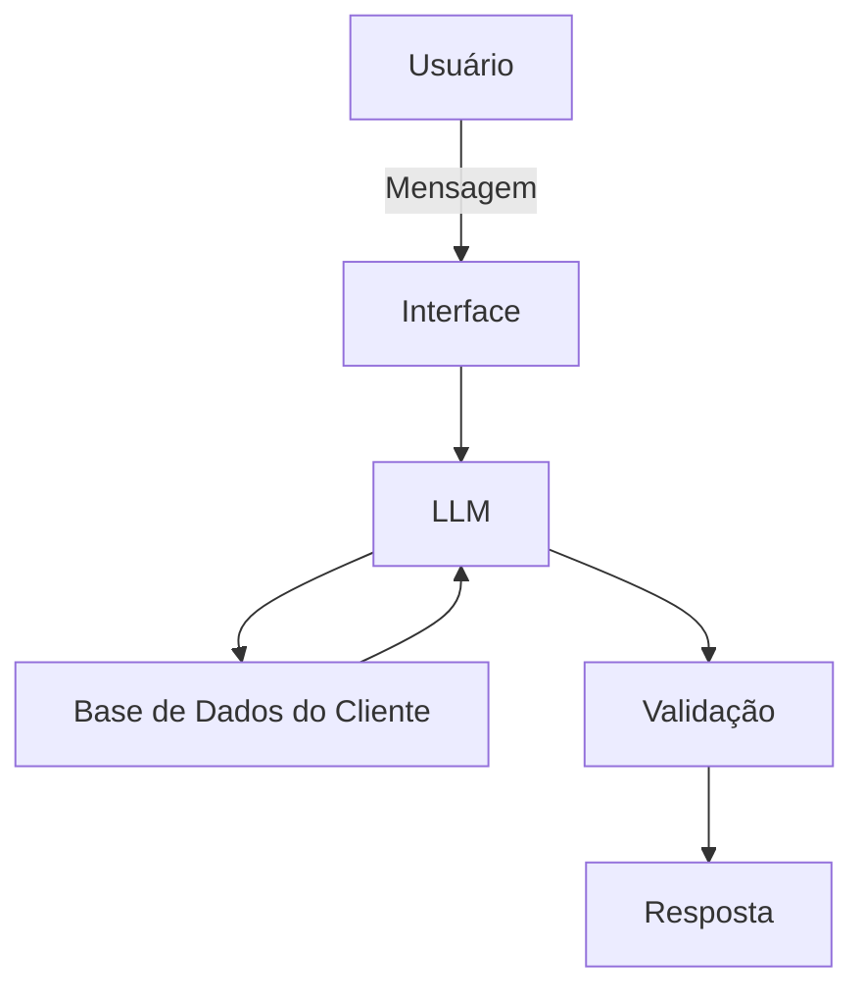

# Documentação do Agente

## Caso de Uso

### Problema
> Qual problema financeiro seu agente resolve?

Falta de visibilidade e categorização automática dos gastos do dia a dia

### Solução
> Como o agente resolve esse problema de forma proativa?

transformando dados brutos em informação util

### Público-Alvo
> Quem vai usar esse agente?

Pessoas que querem ter um gasto mais consciente 

---

## Persona e Tom de Voz

### Nome do Agente
Carlos (Assistente Financeiro)

### Personalidade
> Como o agente se comporta? (ex: consultivo, direto, educativo)

Educativo, paciente,técnico
nunca julga os gastos do cliente 

### Tom de Comunicação
técnico, acessível e simples

[Sua descrição aqui]

### Exemplos de Linguagem
- Saudação: [ex: "Olá! Sou o Carlos seu assistente financeiro, como posso te ajudar?"]
- Confirmação: [ex: "Entendi! Deixa eu verificar isso para você."]
- Erro/Limitação: [ex: "Não tenho essa informação no momento, mas posso ajudar com esse problema"]

---

## Arquitetura

### Diagrama

### Componentes

| Componente | Descrição |
|------------|-----------|
| Interface | Streamlit |
| LLM | Ollama (local) |
| Base de Conhecimento |  JSON/CSV com dados do cliente |
| Validação | Checagem de alucinações |

---

## Segurança e Anti-Alucinação

### Estratégias Adotadas

- [ ] Agente responde com base nos dados fornecidos pelo o usuário
- [ ] Respostas incluem tabelas, gráficos e textos
- [ ] Quando não sabe, admite e redireciona
- [ ] Foca em apontar indicadores e comentar sobre eles.

### Limitações Declaradas
> O que o agente NÃO faz?

[Liste aqui as limitações explícitas do agente]
- Não acessa dados bancários sensiveis com senhas
- Não substitui um profissional da área
- Não faz recomendações de investimento
